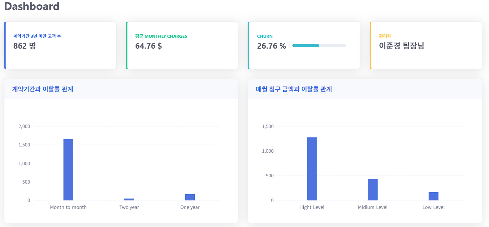
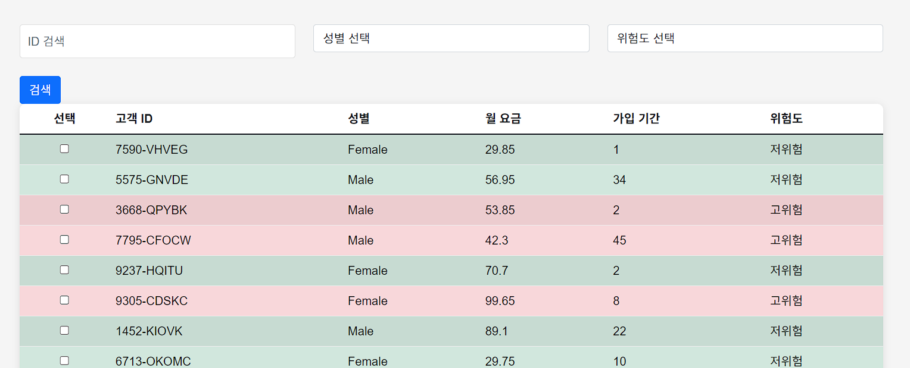

# SKN03-3rd-6Team - 20%

# 👯‍♂️👯 멤버 소개 
|  |  |  |  | 
|:----------:|:----------:|:----------:|:----------:|
| 이준경(팀장) | 방효식 | 허지원 | 장수연 |   
| Django | 데이터분석(EDA) FrontEnd | 데이터분석(EDA) ML Model 구축 | 데이터분석(EDA) FrontEnd| 

# 🖥️ 프로젝트 소개 
관리자를 위한 통계 데이터와 고객 이탈 예측 서비스 

## 페이지 소개
페이지는 크게 통계 분석페이지, 고객관리 페이지, 신규고객 페이지로 구성

### 통계 분석 페이지
 

1. 관리자 입장에서 업무에 필요한 지표를 상단의 CARD 형태로표현
2. 머신러닝 중요 피쳐 5개를 선정하여 그래프 형태로 표현

### 고객 관리 페이지
 

1. 학습시킨 모델을 pickle 파일을 이용해 django 서버에 load
2. 학습시킨 모델을 model.predict_proba()를 이용해 확률로 변환 후, 퍼센트에 따라 위험도 표시 및 색상 (기준 % : 0.4 / 0.7 )
3. 고객 ID, 성별, 위험도에 따라 결과 필터링 기능 

#### 고객 디테일 페이지 

#### 신규 고객 페이지

## 데이터 분석
  [anal.ipynb](anal.ipynb)  <- 머신러닝 코인

1. train dataset data 확인
   
 

2. 원핫인코딩을 통한 독립변수와 종속변수 간 상관관계 확인

 

3. 독립변수간의 다중공선성 확인

 

### 앙상블 모델 (로지스틱, 서포트벡터머신, 그라디언트클래스파이어)
1. 앙상블 모델에 들어갈 모델 선정 : (auto ml 선택 기준 : AUC)
   
  
2. auto ml 상위 모델 confusion matrix , roc curv 확인

    
    

4. 앙상블 모델 train set, test set -> auc 확인

 

5. cross validation 확인 -> 약 85% 의 auc로 이탈을 분류할 수 있음
 
  
   
   

### 5개 중요 요인 선택 - 각 모델의 피쳐 중요도 중 상위 6개 중 겹치는 요인이 많은 변수로 선택 
ex. 로지스틱 회귀 - beta의 절댓값이 큰 수로 
  
- contract 기간 달마다, 1년, 2년 (범주형)
- monthly charges low medi high (범주형)
- tenure 기간 short medi long (범주형)
- fiber optic 사용자
- total charges 기준 : 1500 이하 (범주형)

### 5개 요인 검증 (로지스틱 회귀 결과 5요인 모두 귀무가설을 기각시켜 영향을 미친다고 말할 수 있다.)
-1. contract 기간!
 
 

- 가설 설정
귀무가설 (H0): 세 계약 유형(One year, Two year, Month-to-month) 간의 이탈 확률에는 차이가 없다.
 대립가설 (H1):세 계약 유형 간의 이탈 확률에 차이가 있다.

- 해석: Month-to-month 계약을 가진 고객의 이탈 확률이 One year 계약을 가진 고객에 비해 약 5.87배 높다는 것을 의미합니다.
Month-to-month 계약의 이탈 확률은 One year 계약보다 약 486% 높아진다고 해석할 수 있습니다.
two-year 계약을 가진 고객의 이탈 확률이 One year 계약을 가진 고객에 비해 약 0.23배 낮다는 것을 의미합니다.
Month-to-month 계약의 이탈 확률은 One year 계약보다 약 77% 낮아진다고 해석할 수 있습니다.

-2. fiber optic 사용자

- 가설: H0: internetservice_Fiber optic 변수는 고객의 이탈에 영향을 미치지 않는다 / H1: internetservice_Fiber optic 변수는 고객의 이탈에 영향을 미친다
  
- 해석 : 광섬유 서비스를 사용하는 고객의 이탈 확률이 아닌 고객에 비해 약 4.25배 높으며, 이는 약 325% 증가하는 것이라고 할 수 있습니다.

     
-3. monthly_charges_low,me,high

- 가설 설정
H0: monthly_charges_category_High, monthly_charges_category_Medium, monthly_charges_category_Low은 고객의 이탈에 영향을 미치지 않는다.
 즉, 세 범주 간 고객의 이탈 확률에 차이가 없다.
H1: monthly_charges_category_High 및/또는 monthly_charges_category_Medium은 고객의 이탈에 영향을 미친다.
 즉, 세 범주 중 적어도 하나가 고객의 이탈 확률에 유의미한 영향을 미친다.

- 해석
고객의 요금 범주가 높아질수록 이탈 확률이 유의미하게 증가합니다.
고객이 높은 요금을 지불할 때 이탈 확률은 약 5.06배 높아지고, 중간 요금의 경우에도 이탈 확률이 약 2.92배 높아집니다.
저요금 범주는 기준(reference)으로 설정되어 있으며, 이 두 범주와 비교할 때 유의미한 영향을 미친다고 볼 수 있습니다.

-4. tenure_charges _ short, medium, long
H0: 고객의 tenure (단기, 중기, 장기)와 이탈 여부는 고객의 이탈에 영향을 미치지 않는다.
즉, tenure 범주 간 고객의 이탈 확률에 차이가 없다.
H1: 고객의 tenure (단기, 중기, 장기)는 이탈 여부에 영향을 미친다.
즉, 적어도 하나의 tenure 범주가 고객의 이탈 확률에 유의미한 영향을 미친다.

- 해석: 장기 계약을 가진 고객의 이탈 확률이 단기 계약을 가진 고객에 비해 약 0.15배 낮습니다. 즉, 장기 계약 고객은 단기 계약 고객보다 이탈할 가능성이 약 85.31% 낮습니다.

-5. total_charges_binary_1500 
- 가설
 H0: total_charges_binary_1500 변수는 고객의 이탈에 영향을 미치지 않는다.
 H1: total_charges_binary_1500 변수는 고객의 이탈에 영향을 미친다.
- 해석 즉, total_charges_binary_1500이 1일 때 이탈 확률이 0일 때에 비해 약 2.25배 높아진다고 해석할 수 있습니다, 약 77% 낮습니다.

## 👩🏻‍💻 개발 기간 및 기술 스택

### 2024.09.23 ~ 2023.09.24

### 기술 스택
 
 
 
 
 
 
 

